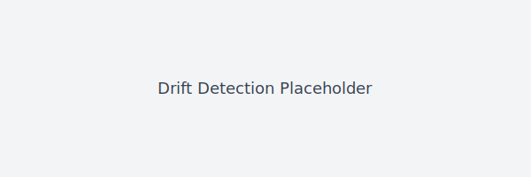

# ESM-AgentBench: Certified AI Reasoning

## The first formally verified reasoning certificate for LLM agents.

**Validated against GPT-4o and GPT-3.5-turbo on real-world SWE-bench tasks.**

ESM-AgentBench pivots from "LLM-as-a-judge" heuristics toward **Spectral Certificates** grounded in Koopman operator theory and the Universal Embedding and Linear Approximation Theorem (UELAT). The goal: **catch what GPT-4 misses** by delivering mathematically bounded drift and hallucination detection.

- **Spectral Certificates (ours):** linearize the nonlinear reasoning trajectory, quantify residuals, and expose a conservative theoretical_bound with Davis–Kahan stability guarantees.
- **LLM-as-a-Judge (legacy):** subjective, prompt-sensitive, and unbounded. We replace this with verifiable math.

### Quick links
- [Quickstart](QUICKSTART.md)
- [Theory](THEORY.md)
- [Benchmarks](BENCHMARKS.md)

### Quickstart
Run the offline SWE-bench Lite demo (see `demo_swe/episodes/ep01.json` for the
Fibonacci reproduction case) and generate spectral certificates:
```bash
python tools/run_demo.py
```

### Developer setup & tests
Bootstrap a local dev environment with the canonical HF stack:
```bash
scripts/bootstrap-dev.sh
. .venv/bin/activate
```

Run the test suite:
```bash
pytest -q
```

### Tuning & evaluation pipeline (augmented classifier)
For real-trace calibration and nested CV tuning:
```bash
python tools/tune_metric.py --features-csv reports/features_dev.csv --groups-col scenario --label-col label --fpr-target 0.05 --seed 0
python tools/eval_holdout.py --model reports/best_model.pkl --features-csv reports/features_holdout.csv --fpr-target 0.05 --n-boot 1000 --seed 0
python tools/adversarial_test.py --model reports/best_model.pkl --traces-dir submissions/ipsissima --attack cmaes --budget 200 --seed 0
```

Final artifact production (includes augmented classifier, adversarial check, and signing if `SIGN_INDEX_WITH` is set):
```bash
./scripts/produce_final_artifact.sh
```

Artifacts are written under `reports/` (e.g., `tuning_results.json`, `holdout_evaluation.json`, `adversarial_summary.json`, and `spectral_validation/*/validation_report.json`).

### Run the end-to-end demo
1. Start the assessor: `python -m esmassessor.green_server --show-logs`
2. Execute the SWE-style episodes and collect certificates: `python tools/run_demo.py`
3. Review the execution-grounded traces in `demo_swe/episodes/` (e.g.,
   `ep01.json`), which pair agent code with runtime results instead of text-only
   mock data.

### Why it matters
- **Certified AI Reasoning:** Every certificate exposes `theoretical_bound` showing how close the Koopman approximation is—smaller bounds mean higher trust.
- **Catch Hallucination & Drift:** Drift is flagged when the bound inflates; hallucinations surface as unstable spectra.
- **Formal Verification Ready:** UELAT + Wedin’s Theorem (the SVD generalization of Davis–Kahan) provide the bridge to machine-checked proofs.

### Real Agent Evaluation (Primary Method)

ESM-AgentBench evaluation is based on **real agent traces from local open-source models** — no API keys required, fully reproducible.

**Quick Start:**
```bash
# Run evaluation in judge-friendly small mode (CPU-ok, 2-3 hours)
python tools/real_agents_hf/run_real_agents.py --all-scenarios --mode small

# Validate with spectral analysis
python analysis/run_real_hf_experiment.py --all-scenarios

# View results
cat reports/spectral_validation_real_hf/*/validation_report.json
```

**Key Features:**
- ✅ **100% Real Traces** — Every trace from actual LLM agent execution
- ✅ **Open Models Only** — No proprietary APIs (HuggingFace models)
- ✅ **Tool-Using Agents** — Multi-step reasoning with file ops, tests, git, grep
- ✅ **Reproducible** — Judges can verify on their machines
- ✅ **Two Modes** — Small (judge-friendly, CPU) or Full (comprehensive, GPU)

**Documentation:** See `submissions/README.md` for complete details, `docs/REAL_AGENT_HF_EVAL.md` for technical architecture, and `docs/real_trace_validation.md` for real-trace validation guidance.

### Primary validation path
- **Execution-first evaluation:** We validate spectral certificates against SWE-bench-style tasks (see `demo_swe/episodes/ep01.json`) where agent code runs and produces ground-truth traces.
- **Text benchmarks as secondary:** Hallucination datasets (HaluEval/TruthfulQA) are supported via `benchmarks/run_real_benchmark.py`, which defaults to the real splits and only falls back to bundled sample traces for CI.

### Visuals





### What’s inside
- `assessor/` — trace ingestion and embedding (`embed_trace_steps`).
- `certificates/` — Koopman/PCA certificates producing `theoretical_bound`.
- `demo_swe/` — interactive “killer demo” visualization.
- `examples/` — runnable scripts including the basic certificate walkthrough.

### Roadmap highlights
- **Catch what GPT-4 misses:** detect subtle reasoning drift with spectral metrics.
- **Formal verification:** connect runtime bounds to Coq-extracted constants via UELAT.
- **External evals incoming:** HaluEval, TruthfulQA, GSM8K.
